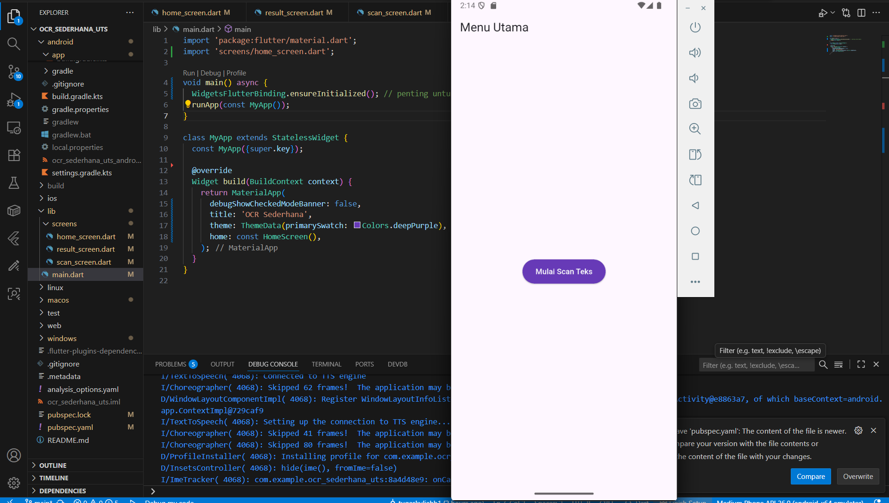
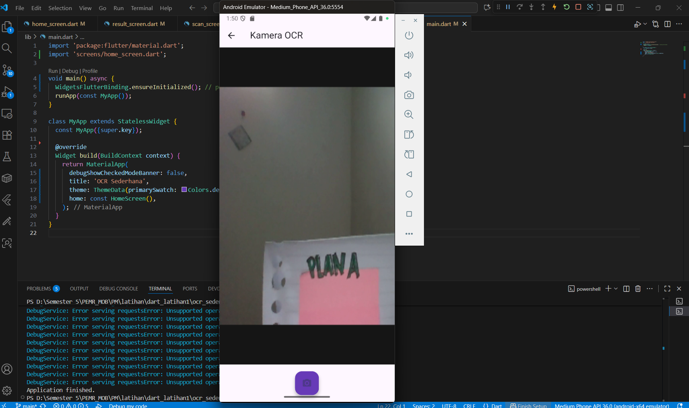
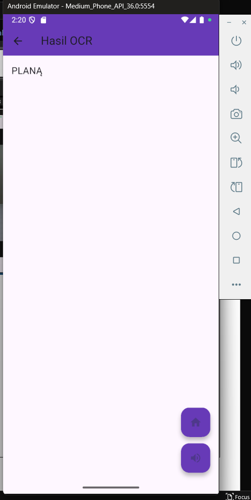

# ocr_sederhana_uts

A new Flutter project.

# Laporan UTS implementasi OCR_SEDERHANA
**Nama:** Ismi Atika  
**NIM:** 2341760036  
**Kelas:** SIB3C  

---

## Hasil UTS

Berikut adalah hasil akhir dari UTS yang telah saya kerjakan dan klik mulai scan

setelah klik mulai scan tampilan akan muncul kamera untuk melakukan scan

Hasil akhir tulisan yang di scan akan terdeteksi

Selanjutnya bisa mendengarkan hasil suara dari teks yang terdeteksi melalui video berikut:  
🎥 [Klik di sini untuk melihat video hasil OCR](image/video.mp4)

Dengan hasil tersebut, aplikasi berhasil menjalankan dua fungsi utama, yaitu *Optical Character Recognition (OCR)* untuk mengenali teks dari gambar dan *Text-to-Speech (TTS)* untuk mengubah teks hasil deteksi menjadi suara.Secara keseluruhan, aplikasi OCR sederhana ini dibangun menggunakan Flutter. Aplikasi ini memiliki kemampuan untuk mengambil gambar melalui kamera, mengenali teks secara otomatis menggunakan OCR, menampilkan hasil deteksi di layar, dan mengubah teks tersebut menjadi suara agar pengguna dapat mendengarkannya dengan mudah.  
